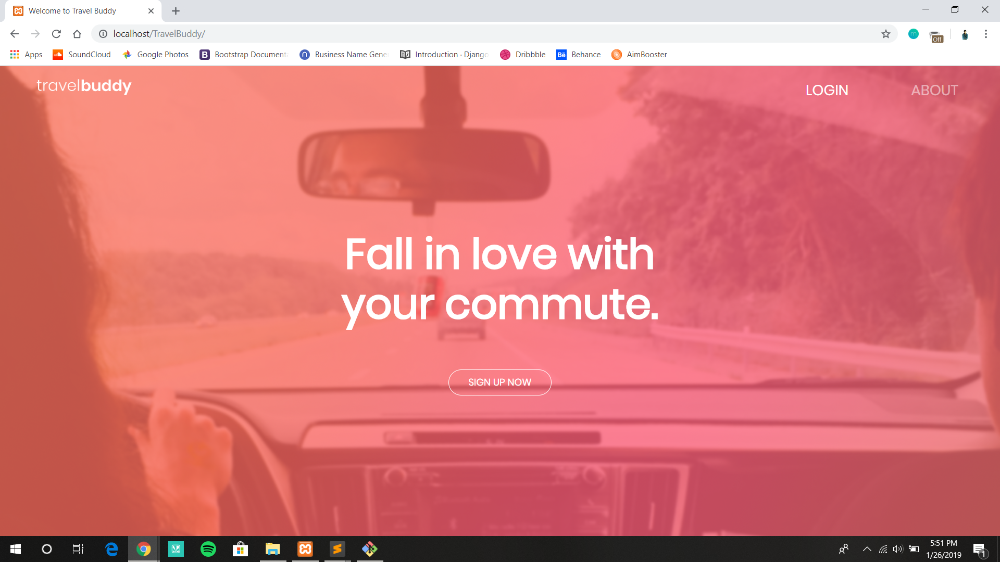

# Travel Buddy

Never travel alone.





## About

A collaborative project in development by Meet Dagar, Dikshant Rawat and Aditya Mehta.

## Technologies used

* PHP & MySQL
* JavaScript
* Bootstrap
* jQuery
* Google Maps API


### Setup MySQL Database

Create Database
```
CREATE DATABASE travelbuddy;
```

Use Database
```
USE travelbuddy;
```

Create users table
```
<<<<<<< HEAD
CREATE TABLE `users` ( `id` INT NOT NULL AUTO_INCREMENT , `firstName` VARCHAR(50) NOT NULL , `lastName` VARCHAR(50) NOT NULL , `email` VARCHAR(200) NOT NULL , `password` VARCHAR(32) NOT NULL , `signUpDate` DATETIME NOT NULL , `startLocation` VARCHAR(100), `endLocation` VARCHAR(100), `bio` TEXT, PRIMARY KEY (`id`)) ENGINE = InnoDB;
=======
CREATE TABLE `users` ( `id` INT NOT NULL AUTO_INCREMENT , `firstName` VARCHAR(50) NOT NULL , `lastName` VARCHAR(50) NOT NULL , `email` VARCHAR(200) NOT NULL , `password` VARCHAR(32) NOT NULL , `signUpDate` DATETIME NOT NULL , `startLocation` VARCHAR(100), `endLocation` VARCHAR(100), `bio` TEXT, 'route' LONGTEXT, PRIMARY KEY (`id`)) ENGINE = InnoDB;
>>>>>>> 6456d9c54975ea228c3786a5fc11cb9e4ff7a83d
```
